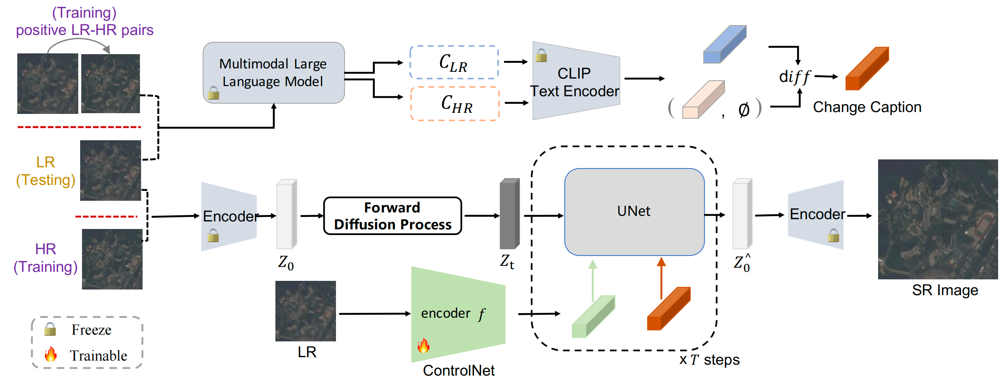
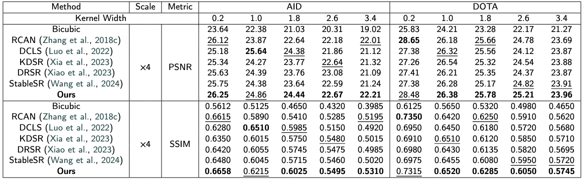
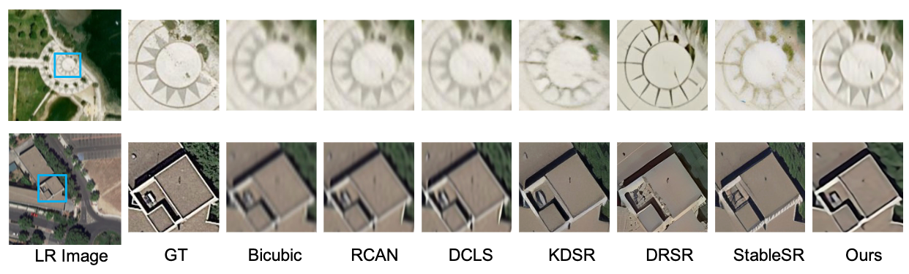
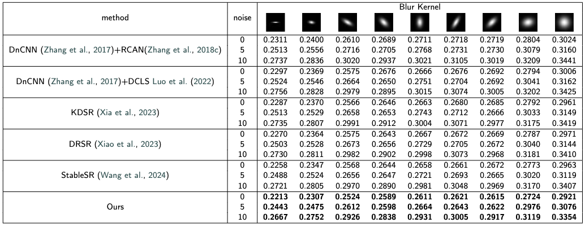
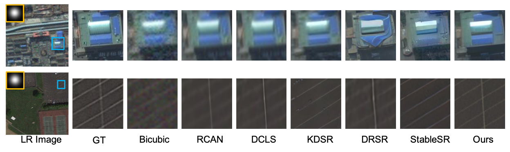

# Multimodal Large Language Models Meet Self-Supervised Diffusion for Real-World Aerial Image Super-Resolution

<div align="center">

**Lijing Lu**$^{a,b,c}$, **Zhou Huang**$^{a,b,c}$, **Yi Bao**$^{a,d,*}$, **Lin Wan**$^{e}$, **Zhihang Li**$^{f}$

$^a$ *Institute of Remote Sensing and Geographic Information System, School of Earth and Space Sciences, Peking University, Beijing 100871, China*  
$^b$ *Beijing Key Lab of Spatial Information Integration & Its Applications, Peking University, Beijing, China*  
$^c$ *Engineering Research Center of Earth Observation and Navigation, Ministry of Education, Beijing, China*  
$^d$ *Institute of Space Earth Science, Nanjing University, Suzhou 215163, China*  
$^e$ *Faculty of Information Engineering, China University of Geosciences, Wuhan 430074, China*  
$^f$ *Institute of Automation, Chinese Academy of Sciences, Beijing 100190, China*

[](LICENSE)
[](https://pytorch.org/)

</div>

---

## 📖 Abstract

Real-world aerial image super-resolution (SR) remains particularly challenging because degradations in remote-sensing imagery involve random combinations of anisotropic blur, signal-dependent noise, and unknown downsampling kernels. Most existing SR methods either rely on simplified degradation assumptions or lack semantic perception of degradation, resulting in limited generalization to real-world conditions. 

To address these gaps, we propose a novel **Diffusion-based SR framework** that integrates **Multi-modal Large Language Models (MLLMs)** and **Self-supervised Contrastive Learning** for extracting degradation-insensitive representations. Specifically:
1. We introduce a **contrastive learning strategy** into a ControlNet module, where the HR and LR counterparts of the same image are regarded as positive pairs, while representations from different images serve as negative pairs, enabling the network to learn degradation-insensitive structural features.
2. We incorporate an **MLLM-generated change caption** as textual guidance into the diffusion process, allowing the model to explicitly perceive and reconstruct different degradation types.
3. A **Classifier-Free Guidance (CFG) distillation strategy** compresses the original dual-branch diffusion model into a single lightweight network, substantially improving inference efficiency while maintaining high reconstruction fidelity.



---

## ⚙️ Requirements

*   **OS**: Ubuntu 18.04
*   **Python**: 3.8
*   **PyTorch**: >= 1.9
*   **CUDA**: 11.1

You can set up the environment with the following commands:

```bash
conda create -n mssd python=3.8
conda activate mssd
pip install torch==1.9.0+cu111 torchvision==0.10.0+cu111 -f https://download.pytorch.org/whl/torch_stable.html
pip install accelerate transformers diffusers
```

## 📂 Dataset Preparation

### 1. Download Datasets
Please download the original datasets from their official websites:
*   **AID**: [Link](https://captain-whu.github.io/AID/)
*   **DOTA**: [Link](https://captain-whu.github.io/DOTA/dataset.html)
*   **NWPU-RESISC45**: [Link](https://www.kaggle.com/datasets/aqibrehmanpirzada/nwpuresisc45)

### 2. Prepare Degraded Data
To simulate real-world degradations, we follow the protocols from **IKC** and **DRSR**.

*   **2.1 Isotropic Blur Degradations**  
    Use the degradation function `generate_mod_LR_bic.py` provided in the [IKC Repository](https://github.com/yuanjunchai/IKC).

*   **2.2 Anisotropic Blur + Noise Degradations**  
    Use the function `generate_mod_LR_bic_aniso.py` provided in the [DRSR Repository](https://github.com/XY-boy/DRSR?tab=readme-ov-file).

---

## 🚀 Usage

### 1. Training
We use `accelerate` for distributed training. Please adjust the configuration based on your GPU resources.

```bash
NCCL_IB_DISABLE=1 NCCL_P2P_DISABLE=1 TORCH_DISTRIBUTED_DEBUG=DETAIL CUDA_VISIBLE_DEVICES=0 accelerate launch \
    train_mssd.py \
    --dataset_name="your dataset" \
    --pretrained_model_name_or_path="checkpoints/stable-diffusion-v1-5" \
    --output_dir="runs/your_project" \
    --resolution=600 \
    --learning_rate=5e-5 \
    --gradient_accumulation_steps=2 \
    --train_batch_size=2 \
    --num_train_epochs=1000 \
    --max_train_samples=10000000 \
    --tracker_project_name="mssd" \
    --enable_xformers_memory_efficient_attention \
    --checkpointing_steps=50000 \
    --control_type="realisr" \
    --mixed_precision="bf16" \
    --dataloader_num_workers=8 \
    --validation_steps 1
```

---
## 📊 Results
### Isotropic Gaussian Blur
Quantitative Results

Visual Comparisons

### Anisotropic Gaussian Blur
Quantitative Results

Visual Comparisons


--- 

## 🤝 Acknowledgement
Our work mainly borrows from the following excellent open-source projects:
* [DRSR](https://github.com/XY-boy/DRSR?tab=readme-ov-file) for the degradation simulation strategy.
* [MoCo](https://github.com/facebookresearch/moco) for the self-supervised contrastive learning concepts.

We thank the authors for their contributions to the community.